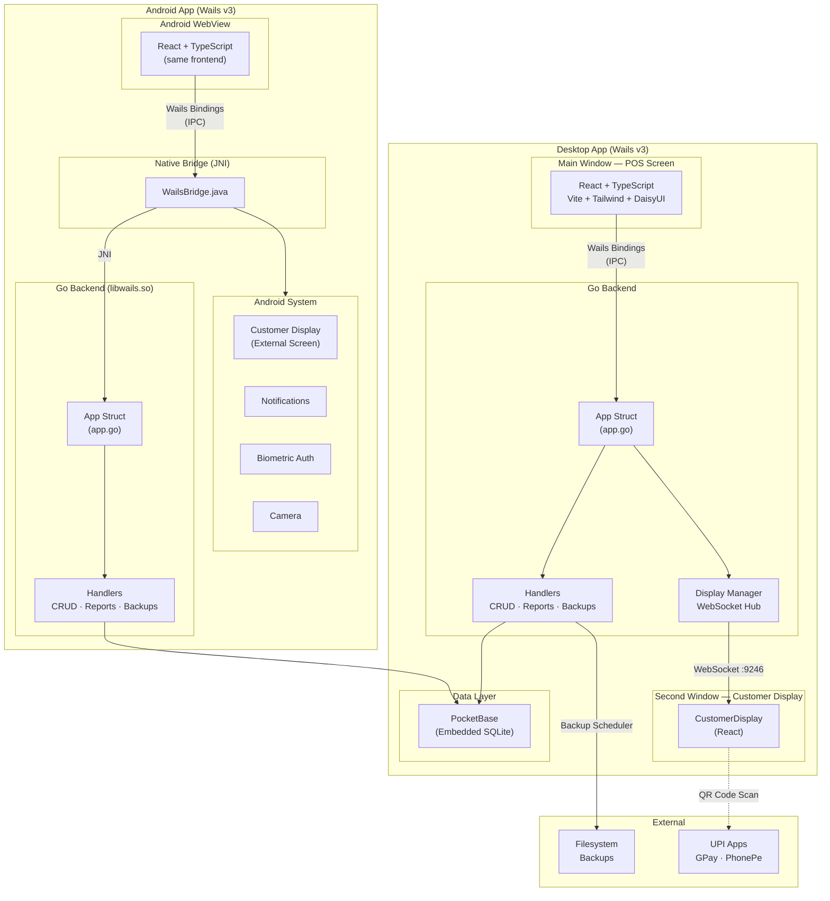
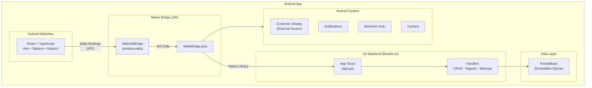

# One Man Shop

Offline POS for small shops. Free and open source.

Built for a friend's small shop. Made open source for everyone.


## Features

- **UPI QR Payments** — Generate a QR code in one tap. Customers pay with GPay, PhonePe, Paytm, or any UPI app.
- **Customer Display** — Show your menu, live bill, and payment QR on a second screen for customers to see.
- **Product Management** — Add up to 50 products with images, prices, and optional tax rates.
- **Sales Reports** — Daily and weekly reports with revenue charts and UPI vs cash breakdown. Export as CSV.
- **Auto Backups** — Nightly backups to OneDrive, Dropbox, or any folder you choose. Never lose data.
- **35 Themes** — Switch between 35 built-in themes instantly. Light, dark, and everything in between.

## Screenshots

| POS Screen | Customer Display | Reports |
|---|---|---|
|  |  |  |

| Products | Settings | Setup Wizard |
|---|---|---|
|  |  |  |

## Architecture



### Data Flow

1. **POS Screen** — React frontend calls Go methods via Wails bindings (auto-generated `bindings.ts`). Go handlers read/write to PocketBase (embedded SQLite).
2. **Customer Display** — A separate native window runs the same React app on route `/#/customer-display`. It connects to a WebSocket server (`ws://127.0.0.1:9246`) that the Go backend pushes state to via the Display Manager.
3. **Backups** — A Go scheduler runs nightly, exporting PocketBase data to a user-chosen folder (OneDrive, Dropbox, etc.).

## Tech Stack

| Layer | Technology |
|---|---|
| Desktop framework | [Wails v3](https://wails.io/) (alpha) |
| Android framework | [Wails v3 Mobile](https://wails.io/docs/guides/mobile) (experimental) — Android WebView + JNI bridge |
| Backend | Go |
| Frontend | React 18, TypeScript, Vite |
| Database | [PocketBase](https://pocketbase.io/) (embedded SQLite) |
| Styling | Tailwind CSS v4, DaisyUI v5 |
| State | Zustand (customer display), React state + `useSettings` hook |
| Charts | Recharts |
| Testing | Vitest + React Testing Library (frontend), `go test` (backend) |

## Installation

### Download

Download the latest release from [GitHub Releases](https://github.com/0yk0/one_man_shop/releases/latest).

- **macOS** — Unzip and drag to Applications. Works on Apple Silicon and Intel.
- **Windows** — Download the `.exe` and run it.
- **Android** — Download the `.apk` and install it on your tablet or phone. See [Running on Android](#running-on-android) for setup instructions.

### First Launch

1. Enter your shop name
2. Set your UPI VPA (e.g. `yourname@upi`)
3. Enter your merchant name
4. Start adding products and selling

## Development

### Prerequisites

- [Go](https://go.dev/dl/) 1.25+
- [Node.js](https://nodejs.org/) 18+
- [Wails v3](https://wails.io/docs/guides/linux) (`go install github.com/wailsapp/wails/v3/cmd/wails@latest`)

### Run in Development

```bash
# Ensure wails3 is in PATH
export PATH="$HOME/go/bin:$PATH"

# Start dev server with hot-reload
wails3 dev
```

This starts both the Go backend and Vite frontend with hot-reload.

### Frontend Only

```bash
cd frontend
npm install
npm run dev    # Vite dev server on port 9245
```

## Building

```bash
# Build for your current platform
wails3 build

# The binary will be in the build/ directory
```

### Platform-Specific

```bash
# macOS (universal binary)
task build:darwin

# Windows
task build:windows

# Android (APK for device)
task android:build
task android:package        # Release APK

# Android (all architectures)
task android:compile:go:all-archs
```

## Running on Android

One Man Shop runs natively on Android tablets and phones. The same Go backend and React frontend are compiled into a native Android app using the Wails v3 mobile bridge.

### Prerequisites

- [Go](https://go.dev/dl/) 1.25+
- [Node.js](https://nodejs.org/) 18+
- [Java JDK](https://adoptium.net/) 11+
- [Android Studio](https://developer.android.com/studio) (recommended — includes SDK, emulator, and build tools)
- Android SDK with:
  - Platform Tools (`adb`)
  - Build Tools
  - Android Emulator (for testing without a physical device)
- [Android NDK](https://developer.android.com/ndk) r26d or later

### Environment Setup

Add these to your shell profile (`~/.zshrc`, `~/.bashrc`, or `~/.bash_profile`):

```bash
# macOS
export ANDROID_HOME="$HOME/Library/Android/sdk"

# Linux
export ANDROID_HOME="$HOME/Android/Sdk"

# NDK (adjust version to match your installed version)
export ANDROID_NDK_HOME="$ANDROID_HOME/ndk/29.0.14206865"

# Add tools to PATH
export PATH=$PATH:$ANDROID_HOME/platform-tools
export PATH=$PATH:$ANDROID_HOME/emulator
```

After editing, reload your shell:

```bash
source ~/.zshrc   # or source ~/.bashrc
```

Verify the setup:

```bash
go version          # 1.25+
java -version       # 11+
adb --version       # Android Debug Bridge
emulator -version   # Android Emulator
```

### Installing Android SDK

**Option A — Android Studio (easiest)**

1. Install [Android Studio](https://developer.android.com/studio)
2. Open SDK Manager (`Tools → SDK Manager`)
3. Install under **SDK Platforms**: Android API 35 (Android 15)
4. Install under **SDK Tools**: Android SDK Build-Tools, Android SDK Platform-Tools, Android NDK (side by side)

**Option B — Command Line Tools**

1. Download [command-line tools](https://developer.android.com/studio#command-tools) from developer.android.com
2. Unzip to `$ANDROID_HOME/cmdline-tools/latest/`
3. Accept licenses and install packages:

```bash
yes | sdkmanager --licenses
sdkmanager "platform-tools" "build-tools;35.0.0" "platforms;android-35" "ndk;29.0.14206865"
```

### Quick Start (Emulator)

The fastest way to get running on Android:

```bash
# 1. Check all dependencies are installed
task android:install:deps

# 2. Build and run on emulator (auto-creates AVD if needed)
task android:run
```

This will:
- Compile Go code as a shared library (`libwails.so`) for the target architecture
- Build the frontend and bundle assets
- Build the Android APK via Gradle
- Start an emulator (if not running) and deploy the app

### Emulator Setup

#### Creating AVDs

Create virtual devices for testing different form factors:

```bash
# Create a tablet AVD (recommended for POS)
avdmanager create avd -n POS_Tablet -k "system-images;android-35;google_apis;arm64-v8a" -d "pixel_tablet"

# Create a phone AVD
avdmanager create avd -n POS_Mobile -k "system-images;android-35;google_apis;arm64-v8a" -d "pixel_8"
```

Or create them via Android Studio: `Tools → Device Manager → Create Device`

#### Managing Emulators

```bash
# List available AVDs
emulator -list-avds

# Start an emulator
emulator -avd POS_Tablet &

# Check running emulators
adb devices
```

#### Deploy to Specific Emulator

```bash
# Deploy to tablet emulator (default)
task android:run

# Deploy to mobile emulator
task android:run:mobile
```

### Build Commands

| Command | Description |
|---|---|
| `task android:install:deps` | Check all Android dependencies are installed |
| `task android:build` | Build APK for current architecture |
| `task android:compile:go:all-archs` | Compile Go for arm64 + x86_64 |
| `task android:assemble:apk` | Assemble debug APK |
| `task android:assemble:apk:release` | Assemble release APK |
| `task android:assemble:aab` | Assemble debug AAB (Android App Bundle) |
| `task android:assemble:aab:release` | Assemble release AAB for Play Store |
| `task android:package` | Full production build → release APK |
| `task android:package:fat` | Production build for all architectures |
| `task android:bundle` | Production AAB for Play Store submission |
| `task android:run` | Build + deploy to tablet emulator |
| `task android:run:mobile` | Build + deploy to mobile emulator |
| `task android:run:device` | Build + deploy to connected physical device |
| `task android:deploy-emulator` | Install release APK to emulator |
| `task android:deploy-device` | Install release APK to physical device |
| `task android:studio` | Open Android project in Android Studio |
| `task android:logs` | Stream filtered logcat output |
| `task android:clean` | Clean build artifacts |

### Physical Device Setup

#### USB Debugging

1. On your Android device, go to **Settings → About Phone**
2. Tap **Build Number** 7 times to enable Developer Options
3. Go to **Settings → Developer Options**
4. Enable **USB Debugging**
5. Connect the device via USB and accept the debug prompt

```bash
# Verify device is connected
adb devices
```

#### Wireless Debugging (Android 11+)

```bash
# Pair with device (one-time)
adb pair <device-ip>:<pairing-port>

# Connect
adb connect <device-ip>:<connect-port>

# Deploy
task android:run:device
```

#### Deploy to Device

```bash
# Build and deploy in one step
task android:run:device

# Or build first, then deploy
task android:build
task android:deploy-device
```

### APK Signing

Release builds require a signing key. Generate one and configure environment variables:

```bash
# Generate a keystore (one-time)
keytool -genkey -v -keystore release.keystore \
  -alias oms \
  -keyalg RSA -keysize 2048 \
  -validity 10000

# Set environment variables (add to ~/.zshrc or ~/.bashrc)
export ANDROID_KEYSTORE_FILE="/path/to/release.keystore"
export ANDROID_KEYSTORE_PASSWORD="your-keystore-password"
export ANDROID_KEY_ALIAS="oms"
export ANDROID_KEY_PASSWORD="your-key-password"
```

Then build a signed release APK:

```bash
task android:assemble:apk:release
```

The signed APK will be in `build/android/app/build/outputs/apk/release/`.

### Play Store Deployment

Google Play requires an Android App Bundle (AAB), not an APK:

```bash
# Build release AAB
task android:assemble:aab:release

# Or use the all-architectures bundle command
task android:bundle
```

The AAB file will be at `build/android/app/build/outputs/bundle/release/`.

To upload:
1. Go to [Google Play Console](https://play.google.com/console)
2. Create a new app or select existing
3. Go to **Production → Create new release**
4. Upload the `.aab` file
5. Fill in release notes and submit for review

### Supported Android Versions

| Property | Value |
|---|---|
| Minimum SDK | 21 (Android 5.0 Lollipop) |
| Target SDK | 35 (Android 15) |
| Compile SDK | 35 |
| Supported ABIs | `arm64-v8a` (devices), `x86_64` (emulator) |

### Android Features

The Android build includes native features beyond the desktop version:

- **Customer Display** — External screen support via Android `Presentation` API
- **Biometric Authentication** — Fingerprint/face unlock for admin access
- **Notifications** — Native Android notifications (API 33+)
- **Haptic Feedback** — Vibration and haptic responses
- **Camera Capture** — Scan barcodes and QR codes
- **File/Folder Pickers** — Native Android Storage Access Framework
- **Secure Storage** — Encrypted SharedPreferences for sensitive data
- **Share** — Native Android share sheet
- **Foreground Service** — Keeps the app alive when backgrounded
- **Keep Awake** — Prevent screen sleep during transactions
- **Torch/Flashlight** — Camera flash control
- **Brightness Control** — Adjust screen brightness programmatically
- **Orientation Lock** — Force portrait or landscape mode
- **TTS (Text-to-Speech)** — Spoken feedback for accessibility

### Architecture



### Troubleshooting

#### "NDK not found"

```bash
# Check installed NDK versions
ls $ANDROID_HOME/ndk

# Set the correct version
export ANDROID_NDK_HOME=$ANDROID_HOME/ndk/29.0.14206865
```

#### "UnsatisfiedLinkError: dlopen failed"

Architecture mismatch between Go library and device/emulator.

```bash
# For physical devices (most are arm64)
task android:build ARCH=arm64

# For emulators (x86_64)
task android:build ARCH=x86_64

# Or build for all architectures
task android:compile:go:all-archs
```

#### Blank WebView

1. Enable WebView debugging in Chrome: `chrome://inspect/#devices`
2. Check logcat for errors:

```bash
task android:logs
```

3. Ensure assets are being served — look for `WailsPathHandler` in logs

#### "cannot find package" or Go module errors

```bash
go clean -modcache
go mod tidy
go mod download
```

#### "CGO_ENABLED required"

```bash
export CGO_ENABLED=1
```

#### App crashes on launch

Check logcat for the crash stack trace:

```bash
adb logcat | grep -E "(FATAL|AndroidRuntime|wails)"
```

Common causes:
- Missing NDK or wrong architecture
- Go compilation errors (check `task android:build` output)
- WebView not available (very old Android versions)

#### Emulator not starting

```bash
# Check if HAXM/Hypervisor is available
emulator -avd POS_Tablet -verbose 2>&1 | head -50

# Try without GPU acceleration
emulator -avd POS_Tablet -no-accel
```

#### APK install fails

```bash
# Uninstall existing version first
adb uninstall in.yk0.oms

# Then install
adb install build/android/app/build/outputs/apk/debug/app-debug.apk
```

## Testing

### Frontend (Vitest)

```bash
cd frontend
npm test                # Run all tests
npm run test:watch      # Watch mode
npm run test:coverage   # With coverage
```

### Backend (Go)

```bash
go test ./backend/...       # Run all backend tests
go test ./backend/... -v    # Verbose output
go test -race ./backend/... # With race detector
```

### Test Coverage

| Area | Tests | What's Covered |
|---|---|---|
| **Backend — Handlers** | 17 | Products CRUD, transactions, settings, reports, CSV export, UPI string |
| **Backend — Models** | 7 | JSON serialization for all model types |
| **Backend — Display** | 10 | State manager, concurrent access, listener callbacks |
| **Frontend — Reports** | 18 | Date helpers, filtering, summation, presets |
| **Frontend — useSettings** | 9 | Settings load/save, setup status, error handling |
| **Frontend — PinInput** | 16 | Input handling, paste, keyboard nav, validation |
| **Frontend — AdminPinModal** | 9 | PIN entry, auto-submit, error state, reset |
| **Frontend — displayStore** | 4 | Zustand state, merge, view transitions |
| **Frontend — SettingsPage** | 6 | PIN section, save button, setup alerts |
| **Frontend — Layout** | 7 | Nav items, PIN gating, sidebar collapse |
| **Frontend — ProductForm** | 22 | Add/edit modes, image upload, tax, validation |
| **Frontend — SetupWizard** | 13 | Multi-step flow, navigation, PIN entry, completion |
| **Frontend — CustomerDisplay** | 17 | Menu/bill/thankyou views, payments, QR code |
| **Frontend — sounds** | 13 | Audio tones, oscillator parameters, singleton reuse |
| **Total** | **181** | |

## Project Structure

```
one_man_shop/
├── main.go                 # Entry point, Wails bootstrap
├── app.go                  # App struct, routes Go methods to handlers
├── app_android.go          # Android-specific data directory logic
├── app_desktop.go          # Desktop-specific data directory logic
├── backend/
│   ├── db/                 # PocketBase init, collection schemas
│   ├── handlers/           # Business logic (CRUD, reports, backups)
│   ├── models/             # Shared Go types
│   └── display/            # Customer display state manager
├── frontend/
│   └── src/
│       ├── bindings.ts     # Auto-generated TypeScript wrappers
│       ├── pages/          # POS, Products, Reports, Settings
│       ├── components/     # UI components
│       ├── stores/         # Zustand store
│       ├── hooks/          # useSettings hook
│       ├── lib/            # Utilities (reports helpers, sounds)
│       └── test/           # Vitest setup
├── build/
│   ├── android/            # Android project (Gradle, Java, manifests)
│   │   ├── app/src/main/java/com/wails/app/  # Java bridge code
│   │   ├── Taskfile.yml    # Android build tasks
│   │   └── build.gradle    # Root Gradle config
│   ├── darwin/             # macOS build tasks
│   └── windows/            # Windows build tasks
└── website/                # Landing page (Vite + framer-motion)
```

## FAQ

**Is it really free?**
Yes. No subscriptions, no hidden fees, no sign-up. Download and start selling.

**Does it work offline?**
Yes. All data stays on your computer. No internet required.

**What payment methods?**
UPI (via QR code) and Cash.

**Can I use a second monitor?**
Yes. Open the Customer Display on a separate screen.

**How many products?**
Up to 50 active products.

**Does it work on Android?**
Yes. One Man Shop runs on Android tablets and phones. Download the `.apk` from [GitHub Releases](https://github.com/0yk0/one_man_shop/releases/latest) or build it yourself — see [Running on Android](#running-on-android).

**Which Android versions are supported?**
Android 5.0 (Lollipop) and above. Tested on Android 10+ tablets and phones.

**Can I use an Android tablet as a POS?**
Yes. The app is designed for single-operator shops and works well on tablets. Use `task android:run` to deploy to a tablet emulator or connect a physical tablet via USB.

**Can I use a second screen on Android?**
Yes. The app supports external displays via Android's `Presentation` API. Connect a monitor via USB-C or Miracast to show the Customer Display on a separate screen.

## Contributing

Contributions are welcome! Whether it's a bug report, feature request, or code contribution, we appreciate your help.

- **[Contributing Guide](CONTRIBUTING.md)** — How to set up development, make changes, and submit PRs
- **[Code of Conduct](CODE_OF_CONDUCT.md)** — Community standards we follow
- **[Security Policy](SECURITY.md)** — How to report vulnerabilities

### Quick Start for Contributors

```bash
# Fork and clone the repo
git clone https://github.com/YOUR_USERNAME/one_man_shop.git
cd one_man_shop

# Install dependencies
cd frontend && npm install && cd ..

# Start development
wails3 dev
```

### Running Tests Before Submitting

```bash
# Backend
go test ./backend/... -v

# Frontend
cd frontend && npm test
```

## Security

For security vulnerabilities, please see our [Security Policy](SECURITY.md). **Do not** report security issues through public GitHub issues.

## License

[MIT](LICENSE)
