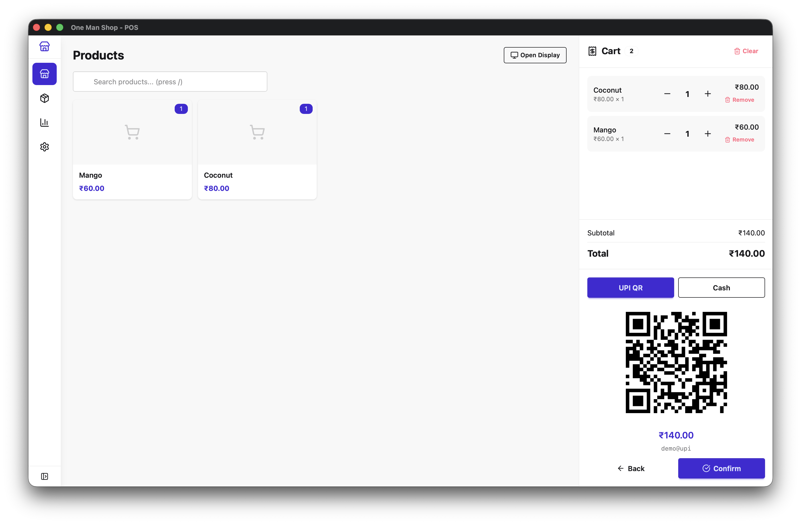
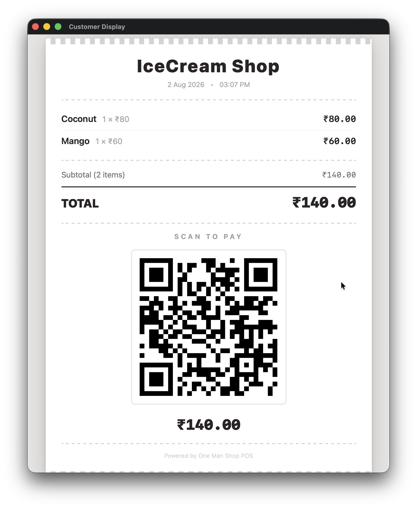
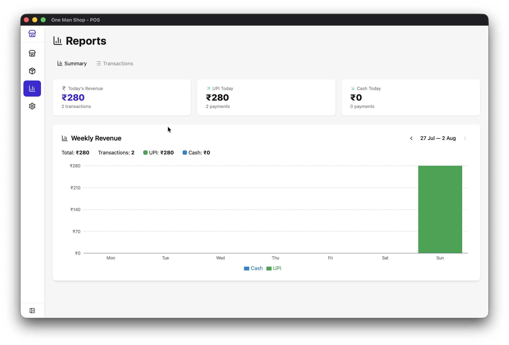
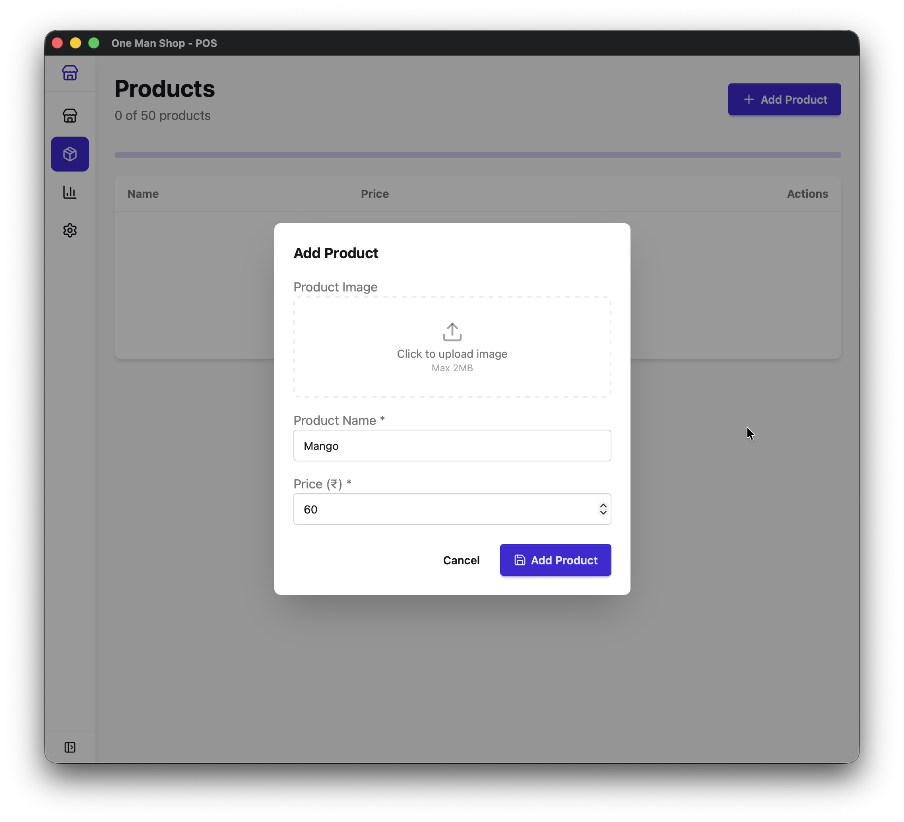
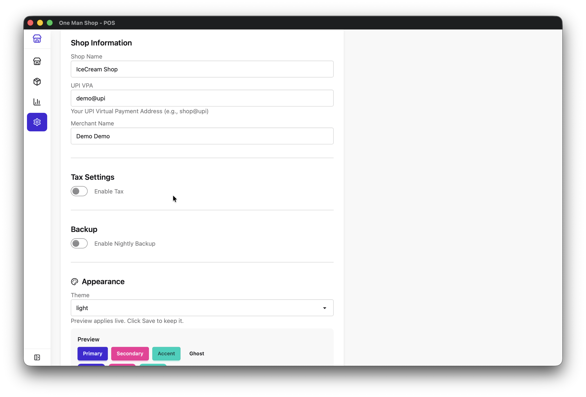
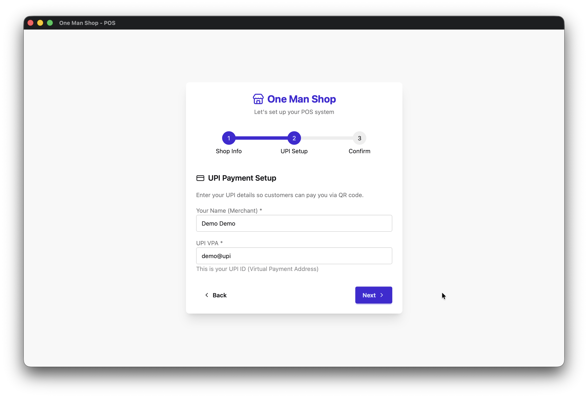
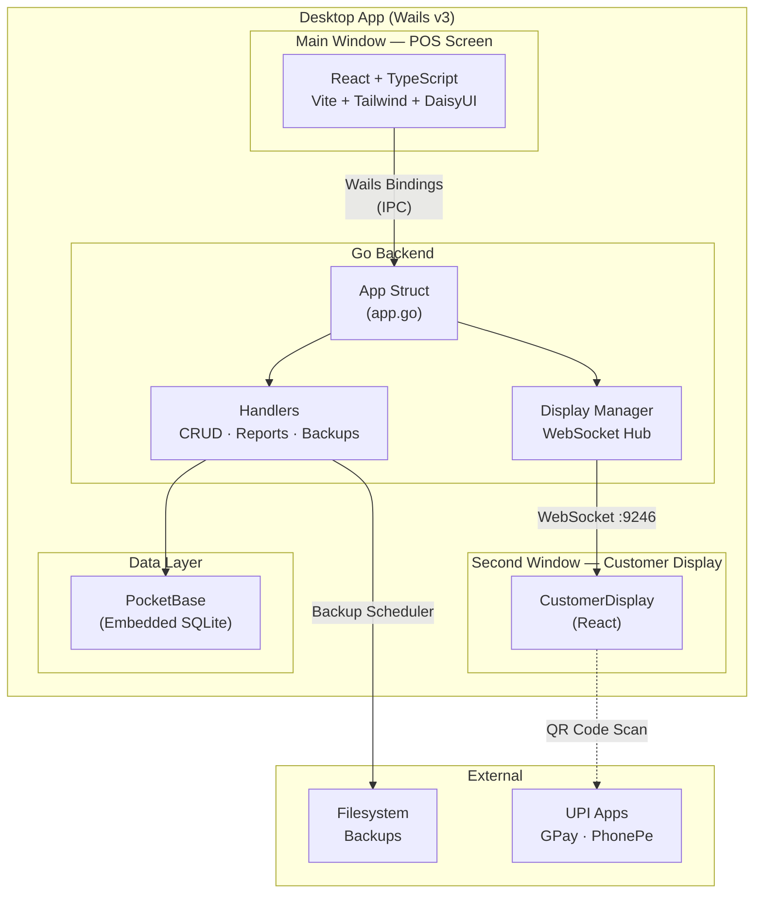

# One Man Shop

Offline POS for small shops. Free and open source.

Built for a friend's small shop. Made open source for everyone.



## Features

- **UPI QR Payments** — Generate a QR code in one tap. Customers pay with GPay, PhonePe, Paytm, or any UPI app.
- **Customer Display** — Show your menu, live bill, and payment QR on a second screen for customers to see.
- **Product Management** — Add up to 50 products with images, prices, and optional tax rates.
- **Sales Reports** — Daily and weekly reports with revenue charts and UPI vs cash breakdown. Export as CSV.
- **Auto Backups** — Nightly backups to OneDrive, Dropbox, or any folder you choose. Never lose data.
- **35 Themes** — Switch between 35 built-in themes instantly. Light, dark, and everything in between.

## Screenshots

| POS Screen | Customer Display | Reports |
|---|---|---|
|  |  |  |

| Products | Settings | Setup Wizard |
|---|---|---|
|  |  |  |

## Architecture



### Data Flow

1. **POS Screen** — React frontend calls Go methods via Wails bindings (auto-generated `bindings.ts`). Go handlers read/write to PocketBase (embedded SQLite).
2. **Customer Display** — A separate native window runs the same React app on route `/#/customer-display`. It connects to a WebSocket server (`ws://127.0.0.1:9246`) that the Go backend pushes state to via the Display Manager.
3. **Backups** — A Go scheduler runs nightly, exporting PocketBase data to a user-chosen folder (OneDrive, Dropbox, etc.).

## Tech Stack

| Layer | Technology |
|---|---|
| Desktop framework | [Wails v3](https://wails.io/) (alpha) |
| Backend | Go |
| Frontend | React 18, TypeScript, Vite |
| Database | [PocketBase](https://pocketbase.io/) (embedded SQLite) |
| Styling | Tailwind CSS v4, DaisyUI v5 |
| State | Zustand (customer display), React state + `useSettings` hook |
| Charts | Recharts |
| Testing | Vitest + React Testing Library (frontend), `go test` (backend) |

## Installation

### Download

Download the latest release from [GitHub Releases](https://github.com/0yk0/one_man_shop/releases/latest).

- **macOS** — Unzip and drag to Applications. Works on Apple Silicon and Intel.
- **Windows** — Download the `.exe` and run it.

### First Launch

1. Enter your shop name
2. Set your UPI VPA (e.g. `yourname@upi`)
3. Enter your merchant name
4. Start adding products and selling

## Development

### Prerequisites

- [Go](https://go.dev/dl/) 1.25+
- [Node.js](https://nodejs.org/) 18+
- [Wails v3](https://wails.io/docs/guides/linux) (`go install github.com/wailsapp/wails/v3/cmd/wails@latest`)

### Run in Development

```bash
# Ensure wails3 is in PATH
export PATH="$HOME/go/bin:$PATH"

# Start dev server with hot-reload
wails3 dev
```

This starts both the Go backend and Vite frontend with hot-reload.

### Frontend Only

```bash
cd frontend
npm install
npm run dev    # Vite dev server on port 9245
```

## Building

```bash
# Build for your current platform
wails3 build

# The binary will be in the build/ directory
```

### Platform-Specific

```bash
# macOS (universal binary)
task build:darwin

# Windows
task build:windows
```

## Testing

### Frontend (Vitest)

```bash
cd frontend
npm test                # Run all tests
npm run test:watch      # Watch mode
npm run test:coverage   # With coverage
```

### Backend (Go)

```bash
go test ./backend/...       # Run all backend tests
go test ./backend/... -v    # Verbose output
go test -race ./backend/... # With race detector
```

### Test Coverage

| Area | Tests | What's Covered |
|---|---|---|
| **Backend — Handlers** | 17 | Products CRUD, transactions, settings, reports, CSV export, UPI string |
| **Backend — Models** | 7 | JSON serialization for all model types |
| **Backend — Display** | 10 | State manager, concurrent access, listener callbacks |
| **Frontend — Reports** | 18 | Date helpers, filtering, summation, presets |
| **Frontend — useSettings** | 9 | Settings load/save, setup status, error handling |
| **Frontend — PinInput** | 16 | Input handling, paste, keyboard nav, validation |
| **Frontend — AdminPinModal** | 9 | PIN entry, auto-submit, error state, reset |
| **Frontend — displayStore** | 4 | Zustand state, merge, view transitions |
| **Frontend — SettingsPage** | 6 | PIN section, save button, setup alerts |
| **Frontend — Layout** | 7 | Nav items, PIN gating, sidebar collapse |
| **Frontend — ProductForm** | 22 | Add/edit modes, image upload, tax, validation |
| **Frontend — SetupWizard** | 13 | Multi-step flow, navigation, PIN entry, completion |
| **Frontend — CustomerDisplay** | 17 | Menu/bill/thankyou views, payments, QR code |
| **Frontend — sounds** | 13 | Audio tones, oscillator parameters, singleton reuse |
| **Total** | **181** | |

## Project Structure

```
one_man_shop/
├── main.go                 # Entry point, Wails bootstrap
├── app.go                  # App struct, routes Go methods to handlers
├── backend/
│   ├── db/                 # PocketBase init, collection schemas
│   ├── handlers/           # Business logic (CRUD, reports, backups)
│   ├── models/             # Shared Go types
│   └── display/            # Customer display state manager
├── frontend/
│   └── src/
│       ├── bindings.ts     # Auto-generated TypeScript wrappers
│       ├── pages/          # POS, Products, Reports, Settings
│       ├── components/     # UI components
│       ├── stores/         # Zustand store
│       ├── hooks/          # useSettings hook
│       ├── lib/            # Utilities (reports helpers, sounds)
│       └── test/           # Vitest setup
├── website/                # Landing page (Vite + framer-motion)
└── build/                  # Build configs, icons, platform tasks
```

## FAQ

**Is it really free?**
Yes. No subscriptions, no hidden fees, no sign-up. Download and start selling.

**Does it work offline?**
Yes. All data stays on your computer. No internet required.

**What payment methods?**
UPI (via QR code) and Cash.

**Can I use a second monitor?**
Yes. Open the Customer Display on a separate screen.

**How many products?**
Up to 50 active products.

## Contributing

Contributions are welcome! Whether it's a bug report, feature request, or code contribution, we appreciate your help.

- **[Contributing Guide](CONTRIBUTING.md)** — How to set up development, make changes, and submit PRs
- **[Code of Conduct](CODE_OF_CONDUCT.md)** — Community standards we follow
- **[Security Policy](SECURITY.md)** — How to report vulnerabilities

### Quick Start for Contributors

```bash
# Fork and clone the repo
git clone https://github.com/YOUR_USERNAME/one_man_shop.git
cd one_man_shop

# Install dependencies
cd frontend && npm install && cd ..

# Start development
wails3 dev
```

### Running Tests Before Submitting

```bash
# Backend
go test ./backend/... -v

# Frontend
cd frontend && npm test
```

## Security

For security vulnerabilities, please see our [Security Policy](SECURITY.md). **Do not** report security issues through public GitHub issues.

## License

[MIT](LICENSE)
