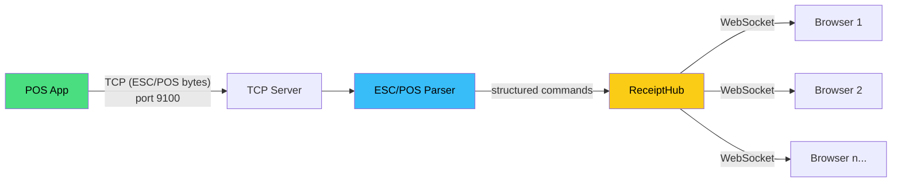
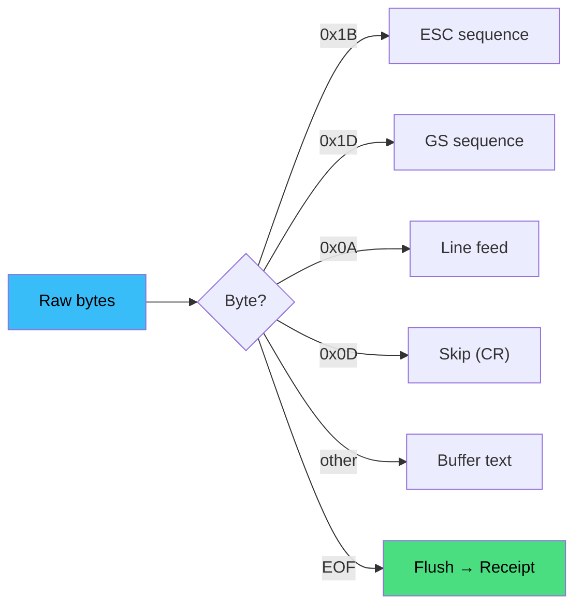

# Thermal Printer Emulator

A standalone TCP-to-WebSocket bridge that emulates a thermal receipt printer. It accepts ESC/POS byte streams on a TCP port and renders receipts in a browser-based UI in real time. Used during development to test receipt printing without physical hardware.

## How It Works

1. The POS app sends raw ESC/POS bytes to `127.0.0.1:9100`.
2. The emulator's TCP server receives the bytes and parses them into structured commands (text, bold, alignment, size, cut, etc.).
3. Parsed receipts are broadcast to all connected browser clients via WebSocket.
4. The Web UI renders each receipt on a simulated thermal paper view.



## Quick Start

### Prerequisites

- Go 1.25+

### Run

```bash
cd emulator
go run .
```

This starts both servers:

| Service | Address | Purpose |
|---------|---------|---------|
| TCP (ESC/POS) | `127.0.0.1:9100` | Receives raw printer data from the POS app |
| Web UI | `http://127.0.0.1:8080` | Browser view of received receipts |

Open `http://127.0.0.1:8080` in your browser to see receipts as they arrive.

### Custom Ports

```bash
go run . -tcp=9200 -web=9090
```

| Flag | Default | Description |
|------|---------|-------------|
| `-tcp` | `9100` | TCP port for incoming ESC/POS data |
| `-web` | `8080` | HTTP port for the Web UI |

## Integration with the POS App

When the emulator is running, the POS app **auto-detects** it and shows a **"Virtual Printer (localhost:9100)"** option in the printer dropdown. No configuration needed.

The detection works by probing TCP port 9100 — if the emulator is not running, the virtual printer option simply doesn't appear.

### Setup

1. Start the emulator (`go run .` from the `emulator/` directory).
2. Open the POS app.
3. Go to **Settings** and select **Virtual Printer (localhost:9100)** from the printer dropdown.
4. Complete a transaction — the receipt appears in the emulator's browser UI.

## Web UI Features

| Feature | Description |
|---------|-------------|
| **Live receipts** | Receipts appear instantly via WebSocket |
| **Paper width toggle** | Switch between 80mm and 58mm view |
| **Receipt history** | Keeps the last 50 receipts; reconnecting clients receive history |
| **Export** | Download the last receipt as a plain text file |
| **Clear** | Clear all receipts from the view |
| **Status indicator** | Green dot = connected, red = disconnected (auto-reconnects) |

## API Endpoints

| Method | Path | Description |
|--------|------|-------------|
| `GET` | `/api/status` | Returns `{"tcp_port":9100,"web_port":8080,"status":"running"}` |
| `POST` | `/api/clear` | Clears receipt history |
| `GET` | `/ws` | WebSocket endpoint for browser clients |

## ESC/POS Command Support

The parser handles the following ESC/POS sequences:

| Sequence | Command | Description |
|----------|---------|-------------|
| `ESC @` | Initialize | Resets printer state |
| `ESC E n` | Bold | Toggle bold (n=1 on, n=0 off) |
| `ESC a n` | Alignment | 0=left, 1=center, 2=right |
| `ESC - n` | Underline | Toggle underline |
| `ESC { n` | Reverse | Toggle reverse video (white on black) |
| `GS ! n` | Character Size | Horizontal (low nibble+1) × vertical (high nibble+1), 1–8× |
| `GS V n` | Cut | n=0 full cut, n=1 partial cut |
| `GS B n` | Beep | n=count, next byte=duration (100ms units) |
| `LF` | Line Feed | New line |
| `CR` | Carriage Return | Skipped (ignored) |

### Parsing Flow



**ESC sequences** (`0x1B` followed by):

| Byte | Command |
|------|---------|
| `0x40` | Initialize (reset state) |
| `0x45` / `0x65` | Bold on/off |
| `0x61` | Alignment (0=left, 1=center, 2=right) |
| `0x2D` | Underline on/off |
| `0x7B` | Reverse on/off |

**GS sequences** (`0x1D` followed by):

| Byte | Command |
|------|---------|
| `0x21` | Character size (1×1 to 8×8) |
| `0x56` | Paper cut (0=full, 1=partial) |
| `0x42` | Beep (count + duration) |

All other 2-byte ESC/GS sequences are silently skipped.

## Web UI Rendering Reference

Each ESC/POS command maps to a specific visual style in the browser:

| Command | CSS Effect |
|---------|------------|
| **Text** | `<div class="receipt-line">` with monospace font |
| **Bold** | Adds `.bold` class (`font-weight: bold`) |
| **Alignment** | Adds `.center` or `.right` class (`text-align`) |
| **Underline** | Adds `.underline` class (`text-decoration: underline`) |
| **Reverse** | Wraps text in `<span class="reverse">` (black background, white text) |
| **Double size** | Adds `.double` class (`font-size: 150%`) |
| **Cut (partial)** | Dashed horizontal line (`border-top: 2px dashed`) |
| **Cut (full)** | Solid horizontal line (`border-top: 2px solid`) |
| **Line Feed** | Ends current line, starts new `<div>` |
| **Initialize** | Resets all state (bold, align, size, etc.) in the renderer |

## WebSocket Message Format

All messages are JSON-encoded over the WebSocket connection.

### `receipt` — sent when a new receipt arrives

```json
{
  "type": "receipt",
  "receipt": {
    "commands": [
      { "type": "initialize" },
      { "type": "align", "align": 1 },
      { "type": "bold", "bold": true },
      { "type": "size", "size_x": 2, "size_y": 2 },
      { "type": "text", "content": "SHOP NAME" },
      { "type": "size", "size_x": 1, "size_y": 1 },
      { "type": "bold", "bold": false },
      { "type": "linefeed" },
      { "type": "text", "content": "------------------------------------------" },
      { "type": "linefeed" },
      { "type": "text", "content": "Coffee x2                2    ₹180.00" },
      { "type": "linefeed" },
      { "type": "cut", "cut_type": "partial" }
    ]
  }
}
```

### `history` — sent to newly connected clients

```json
{
  "type": "history",
  "receipts": [ /* array of receipt objects */ ]
}
```

### `status` — connection confirmation

```json
{
  "type": "status",
  "status": "connected"
}
```

### Command Types

| `type` | Additional Fields | Description |
|--------|-------------------|-------------|
| `text` | `content` (string) | Plain text content |
| `bold` | `bold` (bool) | Bold state toggle |
| `align` | `align` (0/1/2) | Left, center, right |
| `size` | `size_x`, `size_y` (int) | Character multiplier (1–8) |
| `underline` | `underline` (bool) | Underline state toggle |
| `reverse` | `reverse` (bool) | White-on-black state toggle |
| `linefeed` | — | Line break |
| `cut` | `cut_type` ("full"/"partial") | Paper cut indicator |
| `initialize` | — | Printer state reset |
| `beep` | `beep_count`, `beep_duration` | Buzzer command |

## Concurrency & Limits

| Limit | Value | Notes |
|-------|-------|-------|
| **TCP connections** | Unlimited | Each connection spawns a goroutine; 30s read timeout |
| **WebSocket clients** | Unlimited | Stored in a `sync.Map` for lock-free iteration |
| **Receipt history** | 50 max | Oldest receipts are trimmed automatically |
| **TCP read buffer** | 4096 bytes | Per-read chunk size |
| **WS reconnect** | 2s delay | Browser auto-reconnects on disconnect |

## Verifying It Works

### Check the TCP port

```bash
# macOS/Linux — should return nothing if port is in use (expected when running)
nc -zv 127.0.0.1 9100
```

### Check the API

```bash
curl http://127.0.0.1:8080/api/status
# → {"tcp_port":9100,"web_port":8080,"status":"running"}
```

### Send a test receipt via TCP

```bash
# ESC @ (init) + "Hello from terminal" + LF + partial cut
printf '\x1b\x40Hello from terminal\n\x1d\x56\x01' | nc 127.0.0.1 9100
```

The receipt should appear instantly in the browser UI at `http://127.0.0.1:8080`.

## Extending the Emulator

To add support for a new ESC/POS command:

### 1. Add the command type

In `escpos/commands.go`, add a new `CommandType` constant and any relevant fields to the `Command` struct:

```go
const CmdMyNewCmd CommandType = "mycommand"
```

### 2. Parse the byte sequence

In `escpos/parser.go`, add a case inside the `Parse` method's ESC/GS switch blocks:

```go
case 0xXX: // ESC X n
    commands = append(commands, p.flush()...)
    commands = append(commands, Command{Type: CmdMyNewCmd})
    i += 3
    continue
```

### 3. Render in the Web UI

In `emulator/web/app.js`, add a case inside `renderCommands()`:

```js
case 'mycommand':
    // Apply visual effect to the current line
    break;
```

### 4. Add tests

In `escpos/parser_test.go`, add a test function:

```go
func TestParseMyNewCmd(t *testing.T) {
    p := NewParser()
    data := []byte{0x1B, 0xXX, 0x01}
    receipt := p.Parse(data)
    if len(receipt.Commands) != 1 {
        t.Fatalf("expected 1 command, got %d", len(receipt.Commands))
    }
    if receipt.Commands[0].Type != CmdMyNewCmd {
        t.Errorf("expected mycommand, got %s", receipt.Commands[0].Type)
    }
}
```

## Security

- The emulator binds to `127.0.0.1` (localhost only) — not accessible from the network.
- No authentication or TLS — intended for local development only.
- Do not expose ports 9100 or 8080 to the internet.

## Project Structure

```
emulator/
├── main.go                 # Entry point: flag parsing, server setup
├── go.mod                  # Go module (thermal-printer-emulator)
├── go.sum
├── escpos/
│   ├── commands.go         # Command/Receipt types
│   ├── parser.go           # ESC/POS byte parser
│   └── parser_test.go      # Parser unit tests
├── server/
│   ├── tcp.go              # TCP server: accepts ESC/POS connections
│   └── websocket.go        # WebSocket hub: broadcasts receipts to browsers
└── web/
    ├── index.html           # Web UI (single-page, no build step)
    └── app.js               # WebSocket client, receipt rendering
```

## Running Tests

```bash
cd emulator
go test ./escpos/
```

## Building a Standalone Binary

```bash
cd emulator
go build -o thermal-printer-emulator .
./thermal-printer-emulator
```

## Troubleshooting

### "Virtual Printer" not showing in the POS app

- Make sure the emulator is running on port 9100.
- Check that nothing else is using port 9100 (`lsof -i :9100` on macOS/Linux).
- The POS app probes the port with a 500ms timeout — slow systems may need a moment.

### Receipts not appearing in the browser

- Verify the browser is connected (green dot in the UI).
- Check the browser console for WebSocket errors.
- Ensure the Web UI port (8080) isn't blocked by a firewall.

### Connection refused errors

- The emulator only listens on `127.0.0.1` (localhost). It is not accessible from other machines.
- If you changed the port with `-tcp`, update the POS app's printer settings accordingly (the auto-detection probes port 9100 by default).

### Parser doesn't recognize a command

- The parser handles the most common ESC/POS commands used by the POS app.
- Unsupported sequences are silently skipped (2-byte for ESC/3-byte for GS with no match).
- To add support for new commands, edit `escpos/parser.go`.
